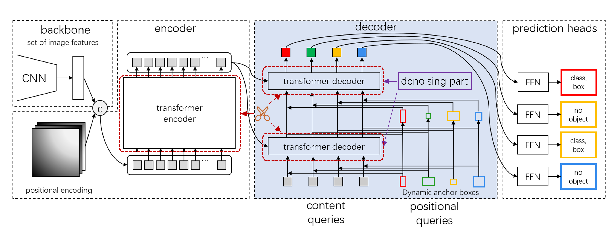

Greedy Pruning Algorithm for DETR Architecture Networks Based on Global Optimization
========

## Introduction
DETR successfully established the paradigm of the Transformer architecture in the field of object detection. Its end-to-end detection process and the idea of set prediction have become one of the hottest network architectures in recent years. There has been an abundance of work improving upon it. However, DETR and its variants require a substantial amount of memory resources and computational costs,
and the vast number of parameters in these networks is unfavorable for model deployment. To address this issue, we propose a Greedy Pruning (GP) method, applied to a variant [DN-DETR](https://arxiv.org/pdf/2203.01305.pdf), which can eliminate redundant parameters in the Transformer module of DN-DETR. Considering the different roles of the MHA module and the FFN module in the Transformer architecture, we further propose a Modular Greedy Pruning (MGP) method. 
This method separates the two modules and applies their respective optimal strategies and parameters. We validated the effectiveness of ours methods on the COCO dataset. The model obtained through the modular greedy pruning method reduced the parameters by **47%** and the GFLOPs by **44%** compared to the Transformer module of the DN-DETR network. At the same time, the AP of model increased from **44.1%** to **45.3%**.


## Model Zoo
We provide our checkpoint files: 
<table>
  <thead>
    <tr style="text-align: center;">
      <th></th>
      <th>name</th>
      <th>box AP</th>
      <th>checkpoint</th>
    </tr>
  </thead>
  <tbody>
    <tr>
      <th>1</th>
      <td>DN-DETR-R50</td>
      <td>44.6</td>
      <td><a href="https://pan.baidu.com/s/1TqvnjsbAjARZp1i8cB2w8A?pwd=niet">BaiDu</a>&nbsp</td>
    </tr>
    <tr>
      <th>2</th>
      <td>DN-DETR-R50-Greedy-Prune</td>
      <td>45.4</td>
      <td><a href="https://pan.baidu.com/s/1wusxOH6REilaeG8fkX7IBQ?pwd=dhuh">BaiDu</a>&nbsp;</td>
    </tr>
    <tr>
      <th>3</th>
      <td>DN-DETR-R50-Modular-Greedy-Prune</td>
      <td>45.3</td>
      <td><a href="https://pan.baidu.com/s/1JfMFFgjN1pTyrUUneetFhA?pwd=dhuh">BaiDu</a>&nbsp;</td>
    </tr>
  </tbody>
</table>


Notes: 
- 1: This result is derived from [DN-DETR](https://link.zhihu.com/?target=https%3A//github.com/FengLi-ust/DN-DETR).
- 2: The result of our Greedy Pruning.
- 2: The result of our Modular Greedy Pruning.
# Usage

## Installation
We use the DN-DETR project as our codebase, hence the environmental installation is consistent with it.

We test our models under ```python=3.8```. Other versions might be available as well.

1. Clone this repo


2. Install Pytorch and torchvision

Follow the instruction on https://pytorch.org/get-started/locally/.
```sh
# an example:
conda install -c pytorch pytorch torchvision
```

3. Install other needed packages
```sh
pip install -r requirements.txt
```

4. Compiling CUDA operators
```sh
cd models/dn_dab_deformable_detr/ops
python setup.py build install
# unit test (should see all checking is True)
python test.py
cd ../../..
```

## Data
Please download [COCO 2017](https://cocodataset.org/) dataset and organize them as following:
```
COCODIR/
  ├── train2017/
  ├── val2017/
  └── annotations/
  	├── instances_train2017.json
  	└── instances_val2017.json
```


## Run
### Eval our pretrianed models

Download our DN-DETR-R50-Greedy-Prune model checkpoint, then run this script:

```sh
python main.py -m dn_dab_detr \
  --output_dir output_greedy \
  --batch_size 4 \
  --coco_path /path/to/your/COCODIR \ # replace the args to your COCO path
  --resume /path/to/our/checkpoint \ # replace the args to your checkpoint path
  --use_dn \
  --cfgs [[[152, 416], [232, 1408], [216, 1504], [232, 1248], [224, 1472], [248, 1344]],
[[8, 136, 544], [184, 192, 1216], [240, 168, 1920], [232, 256, 800], [256, 192, 960], [256, 216, 1216]]]
  --eval
```
Download our DN-DETR-R50-Modular-Greedy-Prune model checkpoint, then run this script:

```sh
python main.py -m dn_dab_detr \
  --output_dir output_greedy \
  --batch_size 4 \
  --coco_path /path/to/your/COCODIR \ # replace the args to your COCO path
  --resume /path/to/our/checkpoint \ # replace the args to your checkpoint path
  --use_dn \
  --cfgs [[[160, 32], [176, 672], [216, 608], [224, 1344], [248, 1248], [248, 1152]],
[[8, 96, 640], [120, 120, 1248], [224, 160, 1120], [176, 144, 576], [224, 256, 672], [216, 152, 1472]]]
  --eval
```


### Prune
#### Prune
Download our DN-DETR-R50 model checkpoint, then run this script to greedy prune:
```sh
python prune_greedy.py -m dn_dab_detr \
  --output_dir output_greedy \
  --coco_path /path/to/your/COCODIR  # replace the args to your COCO path
  --resume /path/to/our/checkpoint \ # replace the args to your checkpoint path
  --batch_size 8 \
  --use_dn
  --map_tol 0.02
  --skip_eval_converge 0.0
```
or run this script to modular greedy prune:
```sh
python prune_greedy_ad.py -m dn_dab_detr \
  --output_dir output_greedy \
  --coco_path /path/to/your/COCODIR  # replace the args to your COCO path
  --resume /path/to/our/checkpoint \ # replace the args to your checkpoint path
  --batch_size 8 \
  --use_dn
  --map_tol 0.10
  --skip_eval_converge 0.02
```
#### Transplant and Fine-tuning
After getting the previously pruned checkpoint, 
run the following script to transplant and fine-tune it
```sh
python main.py -m dn_dab_detr \
  --output_dir output_greedy \
  --coco_path /path/to/your/COCODIR  # replace the args to your COCO path
  --resume /path/to/our/checkpoint \ # replace the args to your pruned checkpoint path
  --batch_size 8 \
  --use_dn
```


## Links
Our work is based on **DN-DETR**. Thanks a lot for this work!